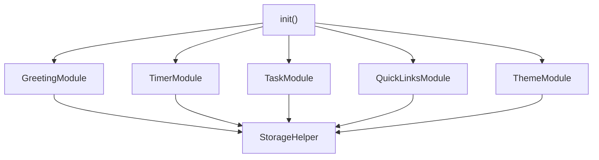
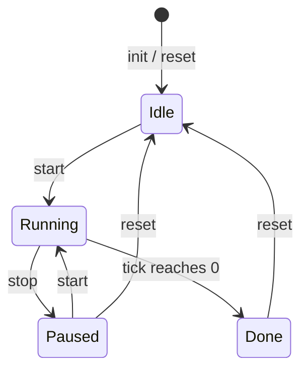

# Design Document — To-Do Life Dashboard

## Overview

The To-Do Life Dashboard is a self-contained personal productivity page delivered as three static files: `index.html`, `style.css`, and `app.js`. No server, build step, or network request is ever needed. Everything the user cares about — tasks, quick links, theme preference, name, sort order — is stored in the browser's `localStorage` and loaded back on every page open.

The JavaScript layer is organized as a **module-object pattern**: `app.js` defines one plain object per feature area (e.g. `GreetingModule`, `TimerModule`, …) and wires them together in a single `init()` call at the bottom of the file. This gives clear namespace separation without requiring ES modules or a bundler, and it works when the file is opened via `file://`.

### Design Goals

- Zero external dependencies — runs entirely from a local file system.
- Each module is responsible for its own DOM slice, its own `localStorage` keys, and its own event listeners.
- Data never lives solely in the DOM; `localStorage` is always the source of truth.
- All mutations to stored data go through dedicated read/write helpers so serialization logic is never duplicated.

---

## Architecture

```
index.html          ← shell markup, section skeletons, links style.css + app.js
style.css           ← all visual rules including CSS custom properties for theming
app.js              ← all behaviour; single file, module-object pattern
```

### Module Dependency Map



`StorageHelper` is not a DOM module — it is a small utility object that wraps `localStorage.getItem` / `setItem` with JSON serialization and provides a typed fallback mechanism. Every feature module calls `StorageHelper` instead of touching `localStorage` directly.

### Runtime Flow

```
Browser opens index.html
  → style.css applied
  → app.js parsed
  → init() called
        → ThemeModule.init()   (apply saved theme before paint to avoid flash)
        → GreetingModule.init() (start clock interval)
        → TimerModule.init()   (render 25:00, bind controls)
        → TaskModule.init()    (load + render tasks, bind controls)
        → QuickLinksModule.init() (load + render links, bind controls)
```

---

## Components and Interfaces

### StorageHelper

Thin wrapper — no domain logic.

```js
StorageHelper = {
  get(key, fallback)   // JSON.parse(localStorage.getItem(key)) ?? fallback
  set(key, value)      // localStorage.setItem(key, JSON.stringify(value))
}
```

**Keys used across modules:**

| Key | Owner module | Value type |
|---|---|---|
| `tld_name` | GreetingModule | `string` |
| `tld_theme` | ThemeModule | `"light" \| "dark"` |
| `tld_tasks` | TaskModule | `Task[]` |
| `tld_sort` | TaskModule | `SortOrder` |
| `tld_links` | QuickLinksModule | `Link[]` |

---

### GreetingModule

**Responsibilities:** Display and auto-update clock, date, greeting prefix, and personalized name.

**DOM slice:** `#greeting-section`

**Key functions:**

```
init()            → reads stored name, starts clock interval, binds name-input submit
tick()            → called every 1 000 ms via setInterval; updates time, date, prefix
getGreetingPrefix(hour: number): string
                  → pure function: maps hour → "Good Morning" | "Good Afternoon" |
                    "Good Evening" | "Good Night"
saveName(name)    → validates non-empty, writes to StorageHelper, re-renders greeting
```

---

### TimerModule

**Responsibilities:** Maintain a 25-minute countdown with Start / Stop / Reset; play audio and show visual alert on completion.

**DOM slice:** `#timer-section`

**State (in-memory only — not persisted):**

```js
{ totalSeconds: 1500, remaining: 1500, running: false, intervalId: null }
```

**Key functions:**

```
init()            → render 25:00, bind button clicks
start()           → guard: no-op if already running; sets running=true, starts setInterval(tick, 1000)
stop()            → clears interval, sets running=false, retains remaining
reset()           → stop(), remaining = totalSeconds, render
tick()            → remaining--; render; if remaining === 0 → complete()
complete()        → stop(); play audio alert; show visual cue
renderTime(s)     → formats seconds → "MM:SS" string
```

**Timer State Machine:**



---

### TaskModule

**Responsibilities:** CRUD for tasks, sort control, localStorage persistence.

**DOM slice:** `#task-section`

**Key functions:**

```
init()            → load tasks + sort pref, render, bind controls
loadTasks(): Task[]
                  → StorageHelper.get('tld_tasks', [])
saveTasks(tasks)  → StorageHelper.set('tld_tasks', tasks)
addTask(desc)     → validate non-empty; build Task; push to array; save; render
editTask(id, newDesc)
                  → validate non-empty; mutate copy; save; render
deleteTask(id)    → filter out by id; save; render
toggleTask(id)    → flip completed flag; save; render
sortTasks(tasks, order): Task[]
                  → pure function; returns NEW sorted array (no mutation of input)
renderTasks(tasks)→ clear list DOM; append one element per task
```

---

### QuickLinksModule

**Responsibilities:** CRUD for quick-access links, opening in new tab.

**DOM slice:** `#links-section`

**Key functions:**

```
init()            → load links, render, bind controls
loadLinks(): Link[]
saveLinks(links)
addLink(label, url)
                  → validate label non-empty, url non-empty, url starts with http:// or https://
                  → build Link; push; save; render
deleteLink(id)    → filter; save; render
renderLinks(links)→ clear DOM; append one element per link
```

---

### ThemeModule

**Responsibilities:** Apply and persist light/dark theme.

**DOM slice:** `document.documentElement` (sets a data attribute / CSS class on `<html>`)

**Key functions:**

```
init()            → load pref (default "light"); apply; bind toggle control
apply(theme)      → document.documentElement.setAttribute('data-theme', theme)
toggle()          → flip current theme; apply; save
```

Theme is implemented entirely via CSS custom properties scoped to `[data-theme="dark"]` and `[data-theme="light"]`, so a single attribute change on `<html>` repaints the whole page instantly.

---

## Data Models

### Task

```jsonc
{
  "id": "task_1721500000000",  // "task_" + Date.now() at creation time
  "description": "Buy groceries",
  "completed": false,
  "createdAt": 1721500000000   // Unix ms timestamp
}
```

**`localStorage` key:** `tld_tasks`  
**Stored as:** JSON array of Task objects.

---

### Link

```jsonc
{
  "id": "link_1721500001234",  // "link_" + Date.now() at creation time
  "label": "GitHub",
  "url": "https://github.com"
}
```

**`localStorage` key:** `tld_links`  
**Stored as:** JSON array of Link objects.

---

### SortOrder (string enum)

```
"newest"      → createdAt descending
"oldest"      → createdAt ascending
"az"          → description ascending (case-insensitive)
"za"          → description descending (case-insensitive)
"incomplete"  → incomplete tasks first, then complete
"complete"    → complete tasks first, then incomplete
```

**`localStorage` key:** `tld_sort`  
**Default:** `"newest"`

---

### Theme

**`localStorage` key:** `tld_theme`  
**Value:** `"light"` | `"dark"`  
**Default:** `"light"`

---

### User Name

**`localStorage` key:** `tld_name`  
**Value:** Plain string  
**Default:** `"Friend"`

---

## Key Algorithms

### Clock Tick

```js
// GreetingModule.init()
this._intervalId = setInterval(() => this.tick(), 1000);

tick() {
  const now = new Date();
  this._renderTime(now);   // HH:MM:SS
  this._renderDate(now);   // e.g. "Monday, 21 July 2025"
  this._renderGreeting(now.getHours());
}
```

A single `setInterval` drives all three displays. The interval is cleared if the module is ever torn down (page hidden, etc.) though in practice the dashboard is a single-page life-of-tab app.

---

### Greeting Prefix Mapping

```js
getGreetingPrefix(hour) {
  if (hour >= 5  && hour <= 11) return "Good Morning";
  if (hour >= 12 && hour <= 17) return "Good Afternoon";
  if (hour >= 18 && hour <= 21) return "Good Evening";
  return "Good Night";  // 22–23 and 0–4
}
```

This is a **pure function** — same hour always produces the same prefix.

---

### Timer Countdown

```js
start() {
  if (this.state.running) return;           // idempotency guard
  this.state.running = true;
  this.state.intervalId = setInterval(() => this.tick(), 1000);
}

tick() {
  this.state.remaining--;
  this.render();
  if (this.state.remaining <= 0) this.complete();
}
```

The timer does NOT persist its state to `localStorage` — if the user refreshes, the timer resets to 25:00. This is intentional: a partial timer state loaded from storage would be stale and confusing.

---

### Sort Comparators

`sortTasks` returns a **new array** — the original `tasks` array stored in memory is never mutated.

```js
sortTasks(tasks, order) {
  const copy = [...tasks];    // shallow copy preserves immutability
  const comparators = {
    newest:     (a, b) => b.createdAt - a.createdAt,
    oldest:     (a, b) => a.createdAt - b.createdAt,
    az:         (a, b) => a.description.toLowerCase().localeCompare(b.description.toLowerCase()),
    za:         (a, b) => b.description.toLowerCase().localeCompare(a.description.toLowerCase()),
    incomplete: (a, b) => Number(a.completed) - Number(b.completed),
    complete:   (a, b) => Number(b.completed) - Number(a.completed),
  };
  return copy.sort(comparators[order] ?? comparators.newest);
}
```

---

### localStorage Read/Write Helpers

```js
StorageHelper = {
  get(key, fallback = null) {
    try {
      const raw = localStorage.getItem(key);
      return raw === null ? fallback : JSON.parse(raw);
    } catch {
      return fallback;
    }
  },
  set(key, value) {
    try {
      localStorage.setItem(key, JSON.stringify(value));
    } catch (e) {
      console.warn('localStorage write failed:', e);
    }
  }
};
```

The `try/catch` in `get` handles corrupted JSON; the one in `set` handles storage-quota errors gracefully.

---

### URL Validation

```js
function isValidUrl(url) {
  return url.startsWith('http://') || url.startsWith('https://');
}
```

Simple prefix check — matches Requirement 14.4 exactly. No regex needed.

---

### ID Generation

```js
function makeId(prefix) {
  return `${prefix}_${Date.now()}`;
}
// e.g. makeId('task') → "task_1721500000000"
```

`Date.now()` is sufficient for single-user, single-tab local use. No UUID library required.

---

## UI Layout

### File Structure

```
index.html      ← page shell, semantic section elements, all visible controls
style.css       ← layout grid, component styles, CSS custom properties for theming
app.js          ← all JS behaviour (module objects + init())
```

### Wireframe (Desktop — ≥ 768px)

```
┌─────────────────────────────────────────────────────────┐
│  [🌙 Toggle]                                   Header   │
│  ──────────────────────────────────────────────────     │
│  Good Morning, Alex!          Monday, 21 July 2025      │
│  14:32:07                                               │
└─────────────────────────────────────────────────────────┘
┌───────────────────────┐  ┌──────────────────────────────┐
│  FOCUS TIMER          │  │  QUICK LINKS                 │
│  25:00                │  │  [+ Label] [URL] [Add]       │
│  [Start] [Stop] [Reset│  │  • GitHub       [✕]          │
│                       │  │  • MDN Docs     [✕]          │
└───────────────────────┘  └──────────────────────────────┘
┌─────────────────────────────────────────────────────────┐
│  TO-DO LIST                    Sort: [Newest ▾]         │
│  [Task description…]  [Add]                             │
│  ☐  Buy groceries              [✎] [✕]                  │
│  ☑  Read chapter 3             [✎] [✕]                  │
└─────────────────────────────────────────────────────────┘
```

### Mobile (< 768px)

All sections stack vertically in a single column. The timer and quick links stack on top of each other rather than sitting side-by-side.

### CSS Custom Properties (theming)

```css
:root { /* light defaults */
  --bg: #f5f5f5;
  --surface: #ffffff;
  --text-primary: #1a1a1a;
  --text-secondary: #555555;
  --accent: #4f46e5;
  --border: #e0e0e0;
}

[data-theme="dark"] {
  --bg: #0f0f0f;
  --surface: #1e1e1e;
  --text-primary: #f0f0f0;
  --text-secondary: #aaaaaa;
  --accent: #818cf8;
  --border: #333333;
}
```

All component styles use only these variables, so `ThemeModule.apply()` triggers a full repaint with a single attribute change.

---

## Correctness Properties

*A property is a characteristic or behavior that should hold true across all valid executions of a system — essentially, a formal statement about what the system should do. Properties serve as the bridge between human-readable specifications and machine-verifiable correctness guarantees.*

**Property reflection note:** The four individual greeting-range properties (Requirements 2.1–2.4) are subsumed by a single universal property over all hours. The theme round-trip (Requirements 16.3–16.4) operates over a two-value enum ("light" / "dark") and is better validated as an example-based test than a property test. Task and link persistence properties (Requirements 11.1–11.2, 13.3) are subsumed by the localStorage round-trip properties. These were merged or downgraded accordingly.

---

### Property 1: localStorage round-trip preserves tasks

*For any* array of Task objects, serializing it to `localStorage` via `StorageHelper.set` and then reading it back via `StorageHelper.get` should produce an array that is deeply equal to the original — preserving each task's `id`, `description`, `completed` flag, and `createdAt` timestamp.

**Validates: Requirements 7.4, 11.1, 11.2**

---

### Property 2: localStorage round-trip preserves links

*For any* array of Link objects, serializing it to `localStorage` via `StorageHelper.set` and then reading it back via `StorageHelper.get` should produce an array that is deeply equal to the original — preserving each link's `id`, `label`, and `url`.

**Validates: Requirements 13.3, 14.2, 15.3**

---

### Property 3: Sort purity — no mutation of source array

*For any* array of Tasks and any valid `SortOrder`, calling `sortTasks(tasks, order)` should leave the original `tasks` array unchanged (same elements in same positions) while the returned array contains exactly the same elements reordered according to `order`.

**Validates: Requirements 12.2**

---

### Property 4: Sort completeness — no tasks lost or duplicated

*For any* array of Tasks and any valid `SortOrder`, the array returned by `sortTasks(tasks, order)` should have the same length as the input and contain exactly the same set of task IDs — no item dropped, no item duplicated.

**Validates: Requirements 12.2**

---

### Property 5: Greeting prefix is total and well-defined for all hours

*For any* integer hour in [0, 23], `getGreetingPrefix(hour)` should return exactly one of the four valid strings — `"Good Morning"`, `"Good Afternoon"`, `"Good Evening"`, or `"Good Night"` — and should never return `undefined`, `null`, or an empty string.

**Validates: Requirements 2.1, 2.2, 2.3, 2.4**

---

### Property 6: `renderTime` is a lossless encoding of seconds

*For any* integer `seconds` in [0, 1500], `renderTime(seconds)` should produce a string matching the pattern `"MM:SS"` such that parsing the minutes and seconds back gives `MM * 60 + SS === seconds` — i.e., no information is lost in the formatting step.

**Validates: Requirements 4.1, 4.3**

---

### Property 7: Task addition grows the list by exactly one

*For any* existing task array and any non-empty, non-whitespace-only description string, calling `addTask(desc)` should result in the persisted task array having exactly one more element than before, and that new element's `description` should equal `desc`.

**Validates: Requirements 7.2, 7.4, 7.5**

---

### Property 8: Whitespace-only descriptions are rejected

*For any* string composed entirely of whitespace characters (spaces, tabs, newlines), attempting to add it as a task via `addTask` should leave the task array completely unchanged.

**Validates: Requirements 7.3**

---

### Property 9: Task completion toggle is an involution

*For any* task in any completion state, toggling its completion status twice should return it to its original `completed` value — the toggle operation is its own inverse.

**Validates: Requirements 9.2, 9.3**

---

### Property 10: URL validation rejects non-http/https schemes

*For any* string that does not begin with `"http://"` or `"https://"`, `isValidUrl(url)` should return `false`, and calling `addLink` with that URL should leave the links array unchanged regardless of the label value.

**Validates: Requirements 14.4**

---

## Error Handling

| Scenario | Handling |
|---|---|
| `localStorage` quota exceeded on write | `StorageHelper.set` catches the `QuotaExceededError`; logs a warning; UI continues working in-memory for the remainder of the session |
| Corrupted JSON in `localStorage` | `StorageHelper.get` catches `SyntaxError`; returns the provided `fallback` value (empty array / default string) |
| Task/link add with empty input | Validate before mutating state; display an inline error message next to the input; do not update storage |
| URL missing scheme | Display inline validation error "URL must start with http:// or https://" |
| Timer double-start | `start()` guards with `if (this.state.running) return` — idempotent |
| Audio alert unavailable (e.g. autoplay blocked) | `play()` returns a Promise; catch rejection silently; the visual cue is always shown regardless |

---

## Testing Strategy

Because this feature is a standalone HTML/CSS/JS application with no build tooling, the testing approach uses two complementary layers.

### Unit Tests (example-based)

Use a lightweight test runner that can run in a browser or via Node.js (e.g. **Vitest** configured for JSDOM, or plain Node with a minimal harness). Target pure logic functions that have no DOM dependency:

- `getGreetingPrefix(hour)` — test all 24 hours map to the correct prefix
- `renderTime(seconds)` — test 0, 60, 1500, and boundary values
- `sortTasks(tasks, order)` — test each of the six sort orders with concrete fixture arrays
- `StorageHelper.get` / `StorageHelper.set` — test round-trip with a mock `localStorage`
- `isValidUrl(url)` — test valid and invalid URL prefixes
- Task CRUD logic (`addTask`, `editTask`, `deleteTask`, `toggleTask`) with mock storage

### Property-Based Tests

Use **fast-check** (importable as a single UMD file with no bundler — `<script src="https://cdn.jsdelivr.net/npm/fast-check/lib/fast-check.min.js">` for browser, or `import fc from 'fast-check'` in a Node test runner).

Each correctness property above maps to one property-based test. Minimum **100 runs per property**.

Tag format for each test:

```
// Feature: todo-life-dashboard, Property N: <property text>
```

Example:

```js
// Feature: todo-life-dashboard, Property 1: localStorage round-trip preserves tasks
fc.assert(fc.property(fc.array(taskArbitrary()), tasks => {
  StorageHelper.set('tld_tasks', tasks);
  const loaded = StorageHelper.get('tld_tasks', []);
  return JSON.stringify(loaded) === JSON.stringify(tasks);
}), { numRuns: 100 });
```

### Example-Based Tests (specific cases not covered by properties)

- Theme toggle saves and loads correctly: set theme to `"dark"`, reload, verify `data-theme === "dark"`; set to `"light"`, reload, verify `data-theme === "light"`. (Two-value enum — example tests are sufficient here; a property test would add no coverage value.)
- Default theme is `"light"` when `localStorage` is empty.
- Default name is `"Friend"` when `localStorage` is empty.
- Timer starts from 25:00 on `init()`.
- Timer stops at `00:00` and calls `complete()`.
- `complete()` calls `audio.play()` and shows the visual cue element.
- Cancelling a task edit leaves storage unchanged.

### Integration / Smoke Tests

Manual browser checks (no automation required per Requirement 17):

- Open `index.html` via `file://` in Chrome, Firefox, Edge, Safari — confirm all sections render.
- Add a task, reload — confirm task persists.
- Toggle theme, reload — confirm theme persists.
- Add a link, click it — confirm it opens in a new tab.
- Run the timer to zero — confirm audio plays and visual cue appears.
- Resize viewport to 320 px width — confirm no horizontal overflow.
